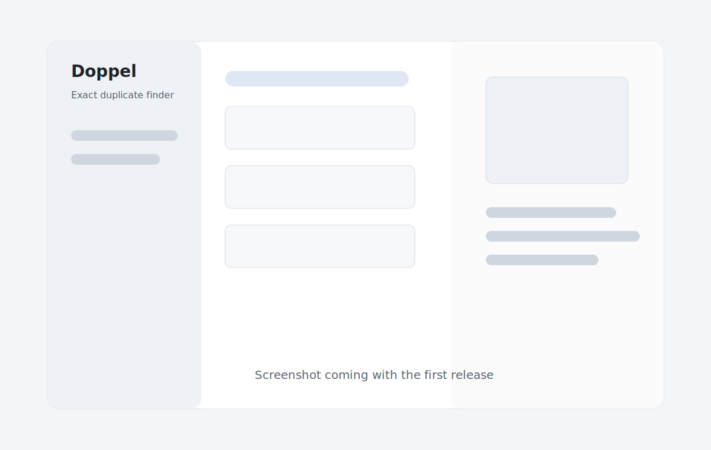

# Doppel

**Exact duplicate finder for macOS. Private, local, safe.**



Doppel is a native macOS app for finding exact duplicate files in one or more folders. It is built for local-first use: no login, no internet, no analytics, no telemetry, no tracking, and no external SDKs.

## Features

- Recursive folder scanning with user-selected folders.
- Duplicate detection by size, SHA-256, and byte-by-byte confirmation in Safe and Paranoid modes.
- Conservative recommendations that keep at least one file in every group.
- iPhone-style copy name handling such as `IMG_4472.HEIC` and `IMG_4472 2.heic`.
- Native SwiftUI interface with sidebar, duplicate groups, and preview details.
- Move selected duplicates to Trash. Doppel never deletes files permanently.
- Export JSON reports.

## Security And Privacy

Doppel is designed to be private by default.

- No network calls.
- No network entitlements.
- No telemetry, analytics, or tracking.
- No login.
- No cloud service.
- No permanent deletion in v0.1.0.
- File actions are performed through native `FileManager` APIs.
- Selected files are moved to Trash, never permanently deleted.
- At least one file is always kept in each duplicate group.

Always review before moving files to the Trash.

## How Detection Works

The MVP scans files, groups candidates by logical file size, calculates SHA-256 for same-sized candidates, and confirms matches byte by byte in Safe and Paranoid modes. Before moving files, Doppel revalidates the keep file and selected duplicate files.

Verification levels shown in the app:

- Same size only.
- Partial hash match.
- SHA-256 match.
- Byte-by-byte confirmed.

## Install From GitHub Releases

Download the latest `Doppel.app.zip` from the [Releases](https://github.com/junowoz/doppel/releases) page, unzip it, and move `Doppel.app` to Applications.

Early builds may not be notarized. macOS Gatekeeper may warn when opening downloaded builds. You can also compile locally from source.

## Build Locally

Requirements:

- macOS 14 or newer.
- Xcode 26 or newer recommended.
- Swift 6 toolchain.

Build and test:

```bash
swift test
swift build
```

Run through the Codex/macOS helper script:

```bash
./script/build_and_run.sh
```

Build a release app bundle:

```bash
./scripts/build_release.sh
```

## Tests

```bash
swift test
```

The test suite covers SHA-256 hashing, partial hashing, byte comparison, duplicate detection, package skipping, recommendation rules, JSON/CSV export, and pre-action validation.

## Signing And Notarization

Local builds may not be signed or notarized. For public distribution with fewer Gatekeeper warnings, use an Apple Developer ID certificate, Hardened Runtime, and notarization.

The release workflow is prepared for signing/notarization secrets, but v0.1.0 does not require them:

- `APPLE_TEAM_ID`
- `APPLE_ID`
- `APP_SPECIFIC_PASSWORD`
- `DEVELOPER_ID_CERTIFICATE_P12_BASE64`
- `DEVELOPER_ID_CERTIFICATE_PASSWORD`

Do not commit real secrets.

## Known Limitations

- v0.1.0 focuses on one or more selected folders, exact duplicates, Trash moves, and JSON export.
- CSV export exists in the core service and is planned for the UI in v0.2.0.
- Review-folder moves, richer progress, security-scoped bookmark persistence, video thumbnails, and iCloud-specific handling are planned after the MVP.
- APFS clone savings can differ from logical file size.
- Hardlinks are detected as same underlying files and should be reviewed carefully.

## Roadmap

- v0.1.0: MVP with scanning, byte confirmation, recommendations, Trash moves, JSON export, tests, docs, and CI.
- v0.2.0: Multiple folder polish, CSV export UI, image previews, review folder moves, progress improvements.
- v0.3.0: Video previews, file filters, minimum size polish, security-scoped bookmark persistence, iCloud handling.
- v1.0.0: Signing, notarization, polished DMG, expanded tests, stable security and privacy policies.

## Contributing

See [CONTRIBUTING.md](CONTRIBUTING.md).

## License

MIT. See [LICENSE](LICENSE).
