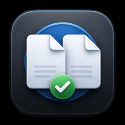
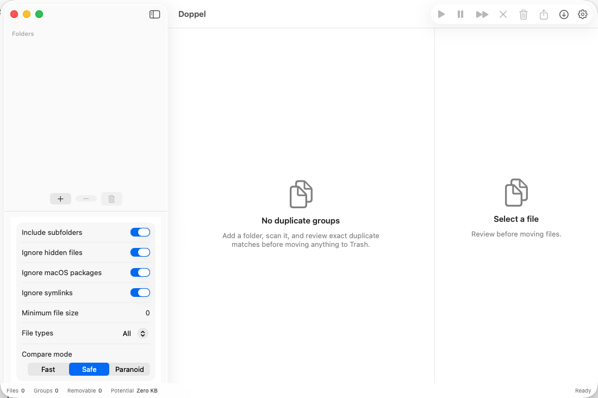
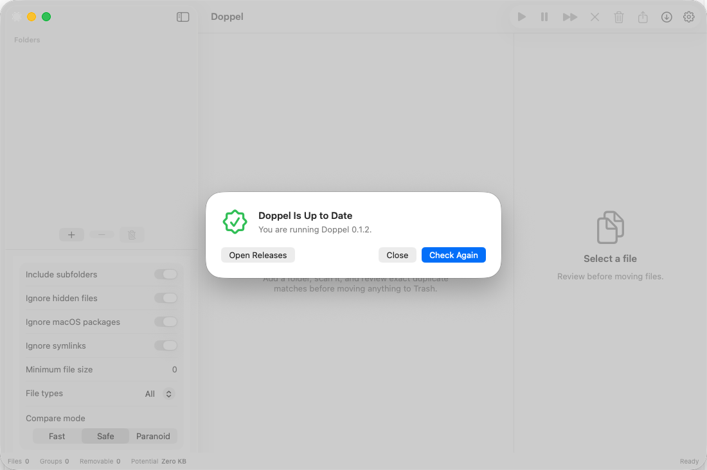
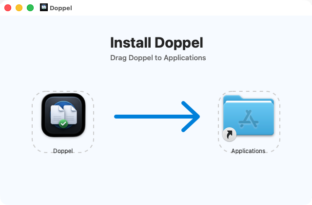

<p align="center">
  
</p>

<h1 align="center">Doppel</h1>

<p align="center">
  <strong>Exact duplicate finder for macOS. Private, local, safe.</strong>
</p>

<p align="center">
  <a href="https://github.com/junowoz/doppel/releases">Download</a>
  ·
  <a href="docs/security.md">Security</a>
  ·
  <a href="docs/architecture.md">Architecture</a>
</p>

Doppel is a native Apple Silicon macOS app for finding exact duplicate files in one or more folders. It is built for local-first use: no login, no analytics, no telemetry, no tracking, and no external SDKs. The only in-app network feature is the user-triggered updater, which checks official GitHub Releases.

## Download

Download the latest Apple Silicon build from [GitHub Releases](https://github.com/junowoz/doppel/releases).

- `Doppel.dmg`: drag-to-Applications installer.
- `Doppel.app.zip`: app bundle archive for manual installs or in-app updates.
- `.sha256` files: checksums for verification.

After downloading the DMG, open it and drag `Doppel.app` to Applications. Builds are Apple Silicon only (`arm64`) and target modern macOS.

## Features

- Recursive folder scanning with user-selected folders.
- Duplicate detection by size, SHA-256, and byte-by-byte confirmation in Safe and Paranoid modes.
- Conservative recommendations that keep at least one file in every group.
- Hardlinked files are marked for review instead of being automatically recommended for removal.
- iPhone-style copy name handling such as `IMG_4472.HEIC` and `IMG_4472 2.heic`.
- Native SwiftUI interface with sidebar, duplicate groups, and preview details.
- Move selected duplicates to Trash. Doppel never deletes files permanently.
- Export JSON reports.
- Built-in updater that checks GitHub Releases, downloads the app archive, verifies the published SHA-256 checksum, validates the app bundle, installs, relaunches, and removes temporary update files.

## Security And Privacy

Doppel is designed to be private by default.

- No telemetry, analytics, tracking, or background network calls.
- Network client entitlement is used only for manual GitHub Releases update checks.
- No login.
- No cloud service.
- No permanent deletion.
- File actions are performed through native `FileManager` APIs.
- Selected files are moved to Trash, never permanently deleted.
- At least one file is always kept in each duplicate group.
- Safe and Paranoid modes revalidate selected files before moving them.

Always review before moving files to the Trash.

## How Detection Works

Doppel scans files, groups candidates by logical file size, calculates SHA-256 for same-sized candidates, and confirms matches byte by byte in Safe and Paranoid modes. Before moving files, Doppel revalidates the keep file and selected duplicate files.

Verification levels shown in the app:

- Same size only.
- Partial hash match.
- SHA-256 match.
- Byte-by-byte confirmed.

## How To Use

1. Open Doppel.
2. Click **Add Folder** and choose the folder you want to scan.
3. Review the scan options in the sidebar.
4. Click **Scan**.
5. Review each duplicate group and the recommended keep/remove badges.
6. Move selected duplicates to Trash only after reviewing them.
7. Export a JSON report if you want an audit trail.

## Screenshots

<p>
  
</p>

<p>
  
</p>

<p>
  
</p>

## Updates

Doppel can update itself from the standalone app. The **Check for Updates** command contacts the official GitHub Releases API only after you click it, then downloads `Doppel.app.zip` and `Doppel.app.zip.sha256`.

Before installation, Doppel verifies:

- The downloaded ZIP matches the published SHA-256 checksum.
- The extracted bundle identifier is `com.junowoz.doppel`.
- The extracted app version matches the GitHub release tag.
- The executable is Apple Silicon only (`arm64`).
- The app bundle passes `codesign --verify --deep --strict`.

Update downloads use an ephemeral URL session and a temporary `DoppelUpdate-*` directory. The updater helper removes temporary files after installation, and Doppel cleans stale update directories on launch.

## Build Locally

Requirements:

- macOS 14 or newer.
- Xcode 26 or newer recommended.
- Swift 6 toolchain.
- Apple Silicon Mac.

Build and test:

```bash
swift test
swift build --arch arm64
```

Run through the Codex/macOS helper script:

```bash
./script/build_and_run.sh
```

Build a release app bundle:

```bash
./scripts/build_release.sh
```

The release script builds an `arm64` app bundle, embeds the app icon and updater helper, performs ad-hoc signing by default, and writes ZIP/checksum artifacts under `dist/`.

## Tests

```bash
swift test
```

The test suite covers SHA-256 hashing, partial hashing, byte comparison, duplicate detection, package skipping, recommendation rules, JSON/CSV export, and pre-action validation.

## Signing And Notarization

Local release builds are ad-hoc signed by default and include SHA-256 checksums. This verifies bundle integrity, but it does not replace Apple Developer ID signing or notarization.

For a download that opens with the smoothest Gatekeeper experience, configure Apple Developer ID signing and notarization before publishing the release. Without that, macOS may ask users to confirm opening the app manually.

The project is prepared for signing/notarization secrets, but the open source repository does not include real secrets:

- `APPLE_TEAM_ID`
- `APPLE_ID`
- `APP_SPECIFIC_PASSWORD`
- `CODESIGN_IDENTITY`
- `DEVELOPER_ID_CERTIFICATE_P12_BASE64`
- `DEVELOPER_ID_CERTIFICATE_PASSWORD`

Do not commit real secrets.

## Known Limitations

- v0.1.x focuses on one or more selected folders, exact duplicates, Trash moves, and JSON export.
- CSV export exists in the core service and is planned for the UI in v0.2.0.
- Review-folder moves, richer progress controls, security-scoped bookmark persistence, video thumbnails, and iCloud-specific handling are planned after the MVP.
- APFS clone savings can differ from logical file size.
- Hardlinks are detected as same underlying files and should be reviewed carefully.

## Roadmap

- v0.1.0: MVP with scanning, byte confirmation, recommendations, Trash moves, JSON export, tests, docs, and CI.
- v0.1.1: Launch polish, Apple Silicon release packaging, app icon, screenshot assets, safe update entrypoint, and hardlink recommendation hardening.
- v0.1.2: Built-in GitHub Releases updater with checksum validation, bundle validation, helper-based install, and temporary file cleanup.
- v0.1.3: Polished DMG installer layout with Applications shortcut and drag-to-install background.
- v0.2.0: Multiple folder polish, CSV export UI, image previews, review folder moves, progress improvements.
- v0.3.0: Video previews, file filters, minimum size polish, security-scoped bookmark persistence, iCloud handling.
- v1.0.0: Signing, notarization, polished DMG, expanded tests, stable security and privacy policies.

## Contributing

See [CONTRIBUTING.md](CONTRIBUTING.md).

## License

MIT. See [LICENSE](LICENSE).
